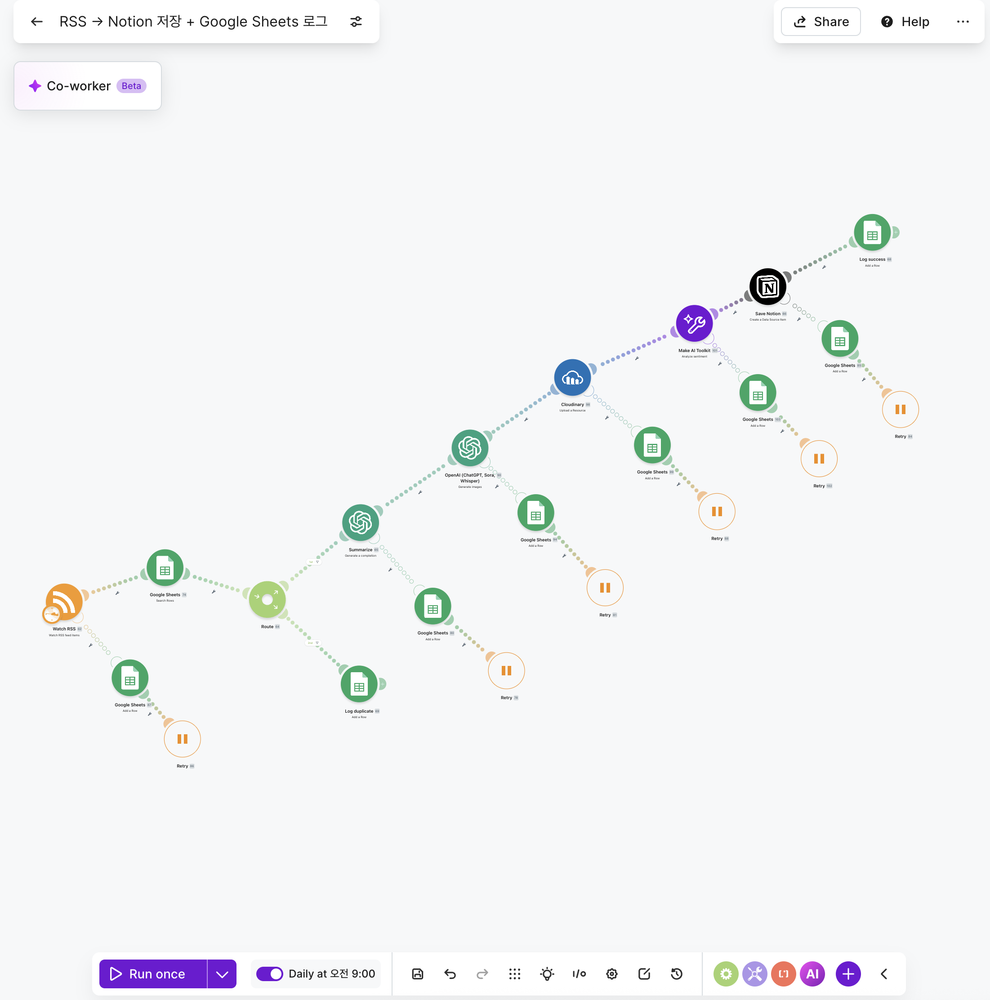
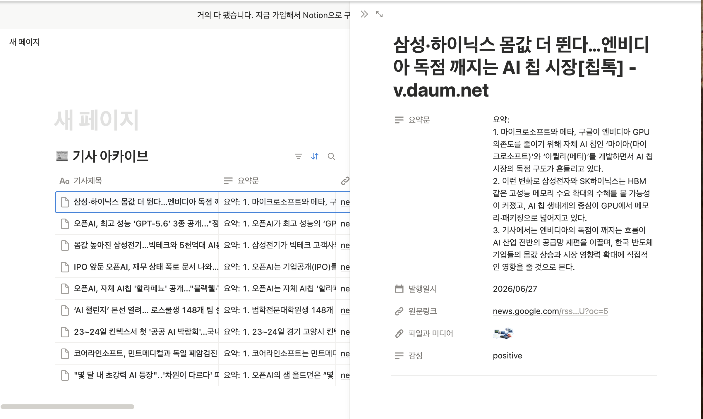
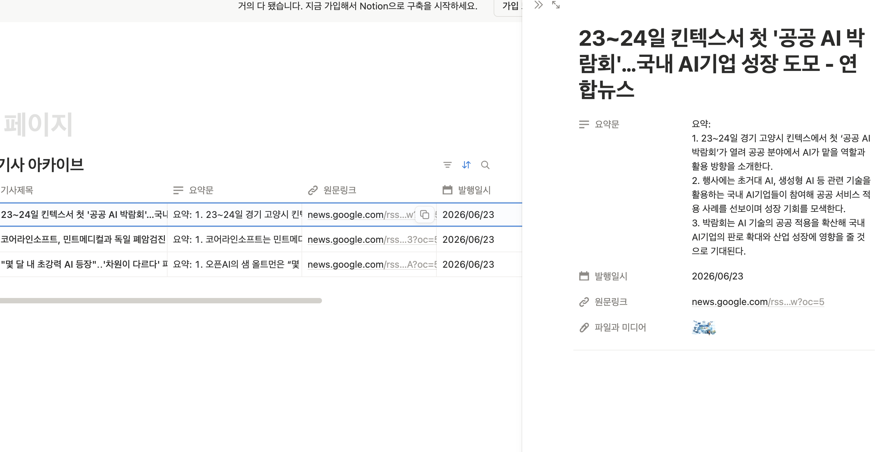
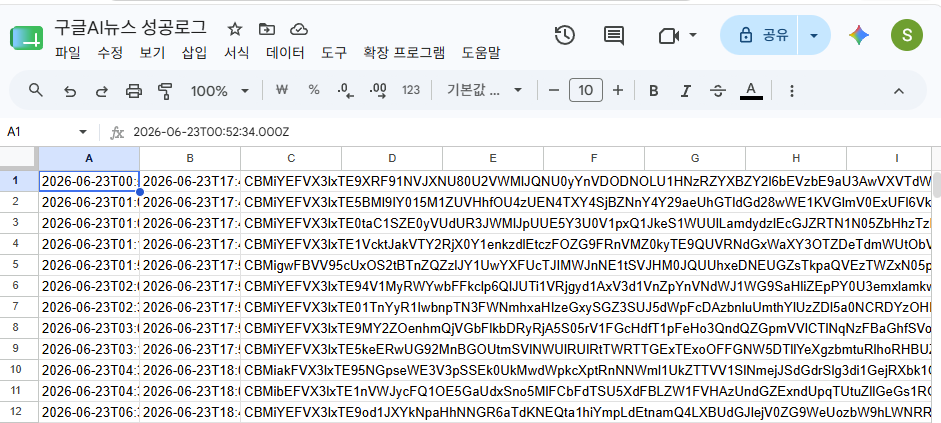
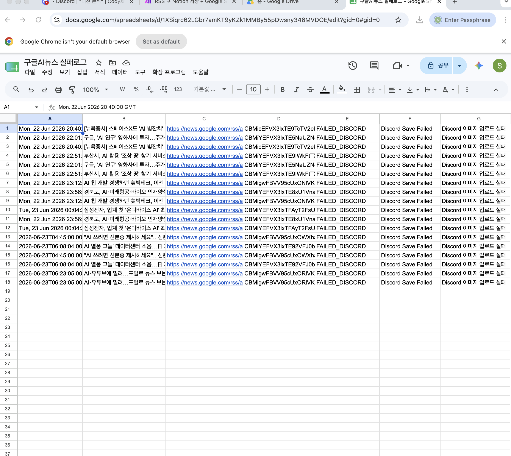

## 요약

|항목|내용|
|-|-|
|주제|AI|
|키워드|AI|
|자동화 도구|Make|
|AI 모델|OpenAI GPT-5.4-mini(요약), GPT Image(썸네일 생성)|
|뉴스 소스|Google News RSS (한국)|
|데이터베이스|Notion Database, Google Sheets|

### 도구 선택 이유

Make는 RSS, OpenAI, Cloudinary, Google Sheets, Notion 등 다양한 서비스를 하나의 워크플로우로 연결할 수 있다. Router와 Error Handler를 통한 조건 분기 및 오류 처리가 직관적이어서 본 프로젝트에 적합하다고 판단했다.

### 필터링 기준 및 이유

**키워드**: **AI**

Google News RSS의 검색 키워드를 **AI**로 설정했다.

AI는 산업, 정책 등 다양한 분야에서 꾸준히 다뤄지는 주제다. 단일 키워드만으로도 충분한 양의 최신 기사를 안정적으로 수집할 수 있다고 봤다.

과제에서 웹 스크래핑 대신 RSS 활용을 권장하고 있어 Google News RSS를 선택했고, 팀원들이 읽기 쉽도록 한국어 뉴스만 수집되도록 RSS 옵션을 적용했다.

\---

## 구현 과정

### 1\. 환경 설정

* Make
* Google News RSS
* OpenAI
* Cloudinary
* Notion
* Google Sheets

API Key 및 Access Token은 Make Connection으로 관리해 문서에 노출되지 않도록 했다.

### 2\. 수집 구성

Google News RSS에서 최신 AI 기사를 수집한다.

중복 여부는 RSS에서 제공하는 **GUID**를 기준으로 확인한다. GUID는 기사의 고유 식별자로, 제목이나 링크보다 안정적으로 중복을 걸러낼 수 있어 채택했다.

### 3\. 요약 연동

신규 기사에 한해 OpenAI API를 호출해 3줄 요약을 생성한다.

#### 프롬프트

```
당신은 뉴스 요약 전문가입니다.

아래 기사를 읽고 다음 규칙에 따라 요약하세요.

규칙
- 핵심 내용만 3줄로 작성 (반드시 3줄, 줄이거나 늘리지 말 것)
- 각 줄은 서로 다른 핵심 포인트를 다룰 것
- 기사에 등장하는 구체적인 기술명, 지명, 수치, 인물 발언을 최소 1개 이상 포함할 것
- 추측하거나 없는 사실을 추가하지 말 것
- 언론사 보도 출처 언급 제외
- AI가 이 사업에서 맡은 역할과 미치는 영향 중심으로 서술
- 한국어로 작성

출력 형식

요약:
1.
2.
3.

제목 : {{62.title}}
본문 : {{62.summary}}
```

### 4\. 저장 연동

Notion Database에 다음 정보를 저장한다.

* 기사 제목
* 요약문
* 원문 링크
* 발행일
* AI 썸네일

### 5\. 스케줄 설정

매일 오전 9시에 자동 실행되도록 설정해, 별도 개입 없이 전체 워크플로우가 돌아가도록 구성했다.

### 6\. 가공 흐름

1. RSS 기사 수집
2. GUID 중복 검사
3. AI 기사 요약
4. AI 썸네일 생성
5. Cloudinary 업로드
6. Notion 저장
7. 성공 로그 기록

### 7\. 에러 처리

각 주요 모듈에 Error Handler를 적용했다.

* RSS 수집 실패 → 실패 로그 기록 후 자동 1회 재시도
* OpenAI 요약 실패 → 실패 로그 기록 후 자동 1회 재시도
* 이미지 생성 실패 → 실패 로그 기록 후 자동 1회 재시도
* Cloudinary 업로드 실패 → 실패 로그 기록 후 자동 1회 재시도
* Notion 저장 실패 → 실패 로그 기록 후 자동 1회 재시도

오류 발생 시 Google Sheets 실패 로그에 오류 내용을 기록해 원인 분석이 가능하도록 했다.

\---

## 재시도 정책

모든 주요 처리 단계에 1회 자동 재시도를 적용했다. 서비스 특성에 따라 재시도 간격은 다르게 설정했다.

* RSS, OpenAI, Cloudinary, Notion : 3분 후 재시도
* AI 이미지 생성 : 5분 후 재시도

## 에러 정책

재시도 이후에도 실패하면 Google Sheets에 오류 정보를 기록한다. 이후 원인 분석과 유지보수에 활용할 수 있도록 구성했다.

\---

# 구현 결과

* 워크플로우 구조 스크린샷



* Notion 저장 결과 스크린샷





* 성공 로그 스크린샷



* 실패 로그 스크린샷



\---

# 회고

## 잘 된 점

처음엔 Make의 AI 기능으로 자동화를 빠르게 구성했다. 그런데 작업 중 AI가 오류를 내면서 모듈 대부분이 날아가버렸다. 되돌리기 기능이 있는 줄도 몰랐던 터라, RSS 수집 모듈 하나만 남은 채로 처음부터 다시 짜야 했다.

결국 이전 구조를 떠올리며 LLM과 함께 모듈을 하나씩 직접 연결해서 완성했다. 귀찮은 과정이었지만 덕분에 워크플로우 구조를 제대로 이해하게 됐고, 혼자서도 자동화를 만들 수 있다는 감각이 생겼다.

## 어려웠던 점

가장 오래 붙잡았던 건 AI 썸네일을 Notion 대표 이미지로 표시하는 부분이었다.

처음엔 Discord를 이미지 호스팅으로 썼는데, 테스트 이후부터 업로드 오류가 계속 났다. 실패 로그를 뒤지고 여러 LLM과 함께 원인을 찾다가 결국 Cloudinary로 갈아탔고, 그제야 Notion에서 썸네일이 제대로 뜨는 걸 확인했다.

Error Handler도 예상보다 시간을 많이 잡아먹었다. 재시도 후 실패 시 이메일 알림을 직접 구현해야 하는 줄 알고 한참 고민했는데, Make에서 기본으로 제공하는 기능이었다. 새 기능을 만들기 전에 공식 문서부터 확인하는 습관이 필요하다는 걸 이번에 몸으로 배웠다.

## 배운 점

이번에 가장 크게 느낀 건 "AI를 활용하는 것"과 "AI에 의존하는 것"의 차이다.

처음엔 AI가 워크플로우를 만들어줬지만, 오류가 터졌을 때 구조를 모르면 아무것도 할 수 없었다. 요리사에게만 주방을 맡긴 사장이 그 요리사가 떠나면 속수무책이 되는 것과 비슷한 상황이었다.

AI는 속도를 높여주는 도구지, 이해를 대신해주는 도구가 아니다. 프로젝트를 유지하고 문제를 직접 해결하려면, 결국 구조를 내가 알고 있어야 한다.

